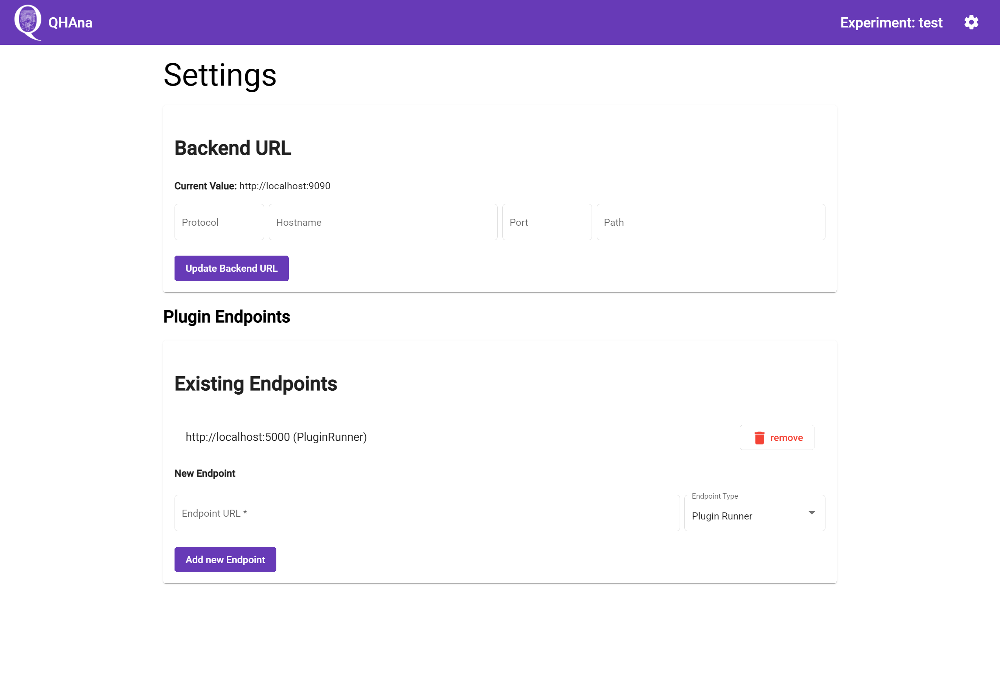
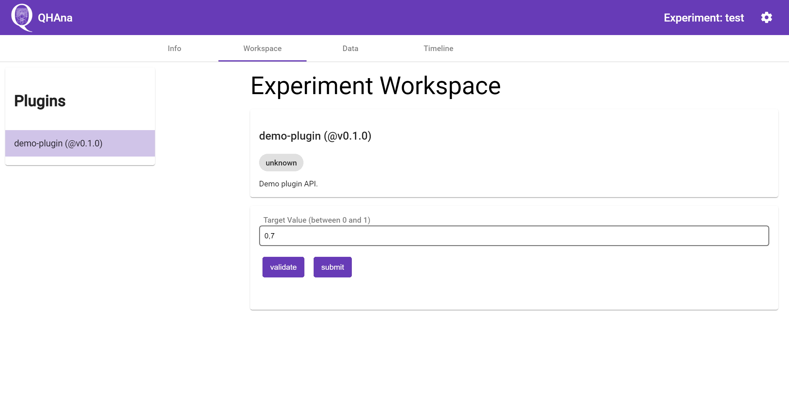

# QC2 Exercise QHAna

## Requirements

 * Python `>=3.7`
 * Docker (with docker-compose)
 * Reccomended: VSCode + Python extension (Pycharm or other IDEs with virtualenv support should also work)

## Setup

Installing the python requirements:

 1. `python -m venv .venv`
 2. Linux/Mac: `source .venv/bin/activate` (with other shells use `activate.fish` or `activate.csh`)\
    Windows: `.venv/Scripts/activate.bat` (With Powershell use `Activate.ps1`)
 3. `python -m pip install -r requirements.txt` (inside the virtual environment)
 4. `flask create-db`
 5. Make sure your IDE uses the virtual environment

Building the docker containers (optional):

Run `docker-compose build` or `docker compose build` (depends on your docker installation) to pre-build all containers to speed up later docker commands.

## Running the Project

### Start the QHAna Components

Start the QHAna components by runnign `docker-compose up` (or `docker compose up`).
This may take a while. To start the components in the background add the `-d` flag to the command.
To stop all components run `docker-compose down`. (hint: all docker compose commands must be executed in the same folder this file is in.)

Open <http://localhost:4200/#/settings> and add `http://localhost:5005` to the Plugin Endpoints.

### Start the Plugin Runner

Restart the plugin runner after code changes to load new code!

VSCode:

In VSCode use the debug config "All" to run or debug the plugin runner.
This will start both the server and the worker process.

Manual:

Make sure your environment variables contain all variables set in `.env` and `.flaskenv` before continuing.

Start the flask server with `flask run`

Start the worker process with `celery --app qhana_plugin_runner.celery_worker:CELERY worker --concurrency 1 --loglevel INFO`

## Implementing the Plugin

The plugin sourcecode is in te `plugins/demo-plugin.py` file.
At the bottom of the file is a method that should provide the actual algorithm implementation of the plugin.

## Using the Plugin in QHAna

 1. Open `http://localhost:4200/` or click on the QHAna logo in the top left corner and add a new Experiment.
 2. Then open the experiment workspace tab (usually `http://localhost:4200/#/experiments/1/workspace` for the first experiment).
 3. Click on the plugin in the list of plugins on the left side of the screen. (if no plugin shows up make sure the plugin runner is running and listed in the settings of the QHAna UI; see [Running the Project](#running-the-project))
    
 4. Input a value and click on submit

All computations are logged in the timeline. Output data can be viewd in the data tab.

To explore all implemented QHAna plugins start the docker-compose file with `docker-compose --profile plugins up` and add `http://localhost:5000` to the Plugin Endpoints in the settings page of the QHAna UI.

## Documentation

Documentation for the QHAna Plugin-Runner that is used to execute the plugins in the `plugins` folder can be found here: <https://qhana-plugin-runner.readthedocs.io/en/latest/>.
For documentation on how to write aplugin directly go to <https://qhana-plugin-runner.readthedocs.io/en/latest/plugins.html>

## QHAna Repositories

 * <https://github.com/UST-QuAntiL/qhana-ui>
 * <https://github.com/UST-QuAntiL/qhana-backend>
 * <https://github.com/UST-QuAntiL/qhana-plugin-runner>

